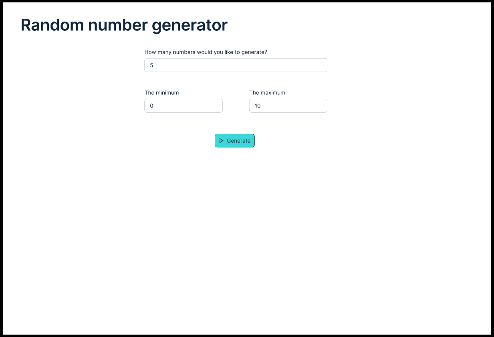
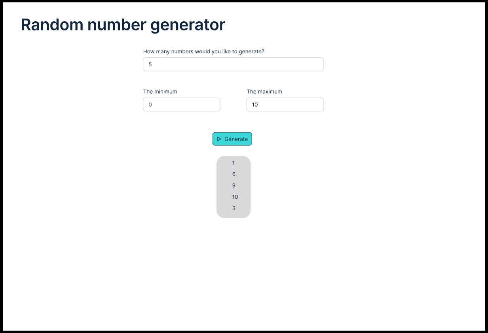
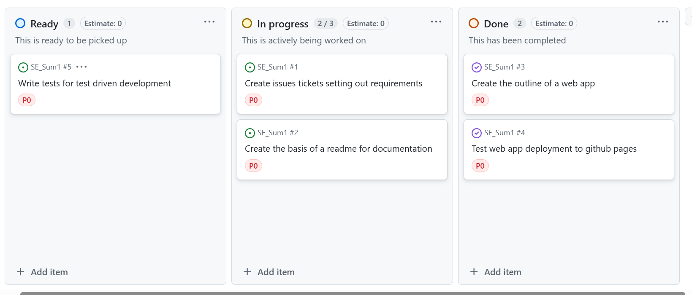

# SE_Sum1

## Project proposal

In this project I am going to create a simple web app for the purpose of randomly generating a list of a specified number of numbers.

## Project design

I used figma to design and prototype my project. This involved creating a basic layout of the app including 3 different inputs and a button to generate the numbers. I used figma protyping to show how once the button was clicked the numbers generated would appear below.

## Project plan

I used github projects along with issues to plan and manage my project.

## Requirements

## Minimal Viable Product

The first stage of creating the minimal viable project (MVP) was first to understand the tech stack. Having never worked with github pages before I first wanted to ensure that my project could be hosted on the platform. I did this by first creating an HTML file and configuring the github actions to upload this to github pages. I then incorporated css into the HTML file and pushed the updates. The github actions enabled each new update to the branch to automatically update the github pages reducing the manual processes. I then tested the incorporation of Javascript using a basic button.

I then focused on writing my unit testing framework to catch any errors during the development phase. This reduces the costs of bug fixes later on in the development.

## Testing

## Documentation

## Evaluation

2.	Design and prototype your product using Figma or an alternative
3.	Plan your project using modern planning techniques (for example, agile with sprints). Use a project management tool (for example, GitHub Projects, a free alternative to Jira). Add a dedicated section to your README that shows how you have used your project management tools
4.	Capture the requirements for your project as issues (aka tickets) accessible via your chosen project management tool
5.	Build the minimal viable product (MVP) or prototype step by step, and have a dedicated section in the README that narrates the process
6.	Use Test Driven Development to produce some of the codebase for your product and set up CI/CD (for example, with GitHub Actions)
7.	Use GitHub or an alternative to add features to your prototype or MVP gradually
8.	Document your MVP with both user and technical documentation. The user documentation should guide end users on how to use your app, while the technical documentation should explain the code, how to run the application locally, and how to conduct tests
9.	Maintain the ticketing system to keep the documentation up to date. Conventionally, one ticket corresponds to one feature, which in turn corresponds to one branch and one pull request. Bug tickets are documented differently from feature tickets
10.	Evaluate your product in a dedicated “Evaluation” section of your README
