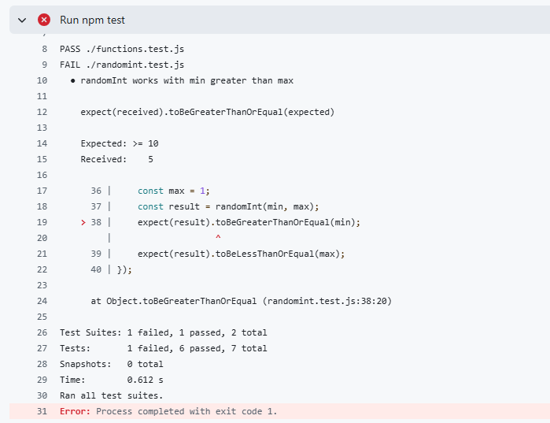
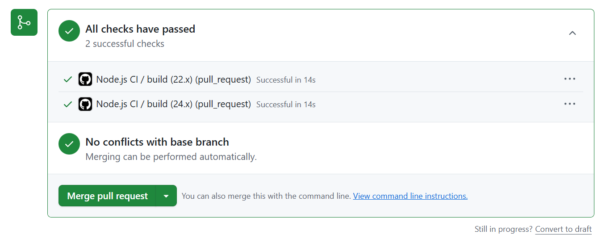
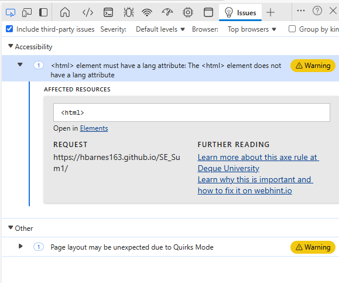
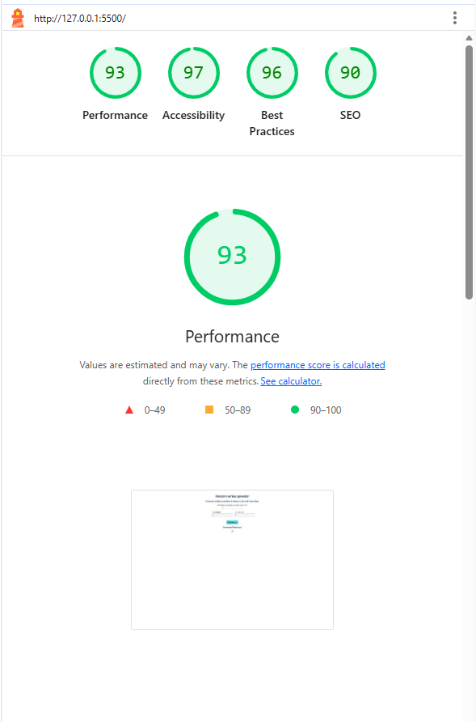
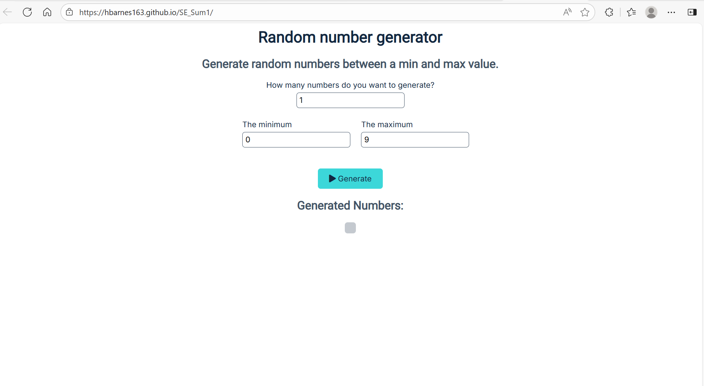

# Random number generator

## Project proposal

In this project I am going to create a simple web app for the purpose of randomly generating a list of a specified number of numbers. There will also be options for specifying a minimum and maximum value.

## Project design

I used figma to design and prototype my project. This involved creating a basic layout of the app including 3 different inputs and a button to generate the numbers. I used figma protyping to show how once the button was clicked the numbers generated would appear below.

The final project differed slightly from this design.

## Project plan

I used github projects along with issues to plan and manage my project.

To do this I used an agile framework based around sprints, this was because due to holidays I needed to be flexible with project delivery. Working iteratively also ensured that I was able to continuously test the code and deployment with github pages ensuring that errors were spotted early on. I ensured I had a basic plan for each sprint by following a timeline as can be seen below, however, I added additional issues and tasks during each sprint when problems arose.

When writing the tests to check the random integer generator functionality the CI testing which I set-up earlier raised an error in the tests, thankfully this was easily fixable at this stage and I addressed the error in the current sprint by raising additional tickets and reprioritising other tickets accordingly.

## Requirements

I used github issues to set out the requirements of the project using github projects to label the different priorities so it was easy to see the relative importance of meeting each requirement in the sprint. There are additional requirements which are left as open tickets which could be completed in a second stage of the project using additional sprints but are not necessary for delivery of the MVP.

Once the requirements for the project had been satisfied I merged that branch into the main branch using a pull request. I ensured that the issue was linked to the pull request by tagging it, however, noticed that this often resulted in duplications of an issue as it existed as a pull request and issue in the github project. Hence, I altered the github projects workflow to only add issues rather than pull requests to the project to fix this issue.

## Minimal Viable Product

The first stage of creating the minimal viable project (MVP) was first to understand the tech stack. Having never worked with github pages before I first wanted to ensure that my project could be hosted on the platform. I did this by first creating an HTML file and configuring the github actions to upload this to github pages. I then incorporated css into the HTML file and pushed the updates. The github actions enabled each new update to the branch to automatically update the github pages reducing the manual processes. I then tested the incorporation of Javascript using a basic button and found this successful on the deployed website.

I then focused on writing my unit testing framework to catch any errors during the development phase. This reduces the costs of bug fixes later on in the development. To do this I created a basic functions file with a simple test using the jest testing framework.

After this I expanded the HTML to contain all the inputs and outputs which would be needed in the final application. After doing this I linked the javascript button with the generate button and tested printing a simple text string as the output. I then tested this locally using Live Server where I noticed that the button was not working and a string would not be printed. Upon doing further research I noticed that to import functions into a javascript file for web app you needed to use ES module syntax rather than CommonJS syntax. Once I fixed this the web app ran correctly, however, the tests stopped running as the Jest testing framework I used worked only on CommonJS syntax. To address this I installed and setup the Babel config file, which explicitally calls for ES module syntax to be converted to CommonJS so that the Jest testing runs correctly.

After testing all the HTML and Javascript manually I then added the CSS styling, I referenced the figma design I created earlier while making some tweaks to make the application more user friendly and accessible. 

## Testing

### Continuous integration testing

I started with a very basic test framework to ensure that jest was working correctly on my system. 

 

Once I had ensured that the tests were working correctly locally I pushed them to github. I then used github actions to setup continuous integration testing. This means that whenever changes are push or a pull request is started the tests are automatically conducted ensuring that errors are picked up immediately. This saves time running tests manually and ensures that high code standards are met.

### Manual testing

I also conducted manual testing using the web app to ensure that users would find the app easy to use and not encounter any bugs. While doing this I noticed that it was hard to tell when the button was hovered over as it didn't change formatting, hence I added additional CSS styling to address this issue. All other parts of the application worked as expected. Ahead of final release I would also have the end users conduct UAT testing to identify any final bugs.

### Accessibility testing

I used the issues tab to inspect the hosted webpage on github pages to view any accessibility concerns. This showed an issue of the HTML element not having a language attribute. This poses an issue for those with screen readers which might be unsure which language the webpage is in.

I also used google lighthouse to test the webpage. This resulted in a very good score across all tested attributes including accessibily which scored a 97.

## User documentation

### Using the website

The application can be accessed from the following [website](https://hbarnes163.github.io/SE_Sum1/). On the website there are 3 different numeric inputs. 

**How many numbers do you want to generate?** takes a positive integer input for the number of numbers to generate
**The minimum** and **The maximum** each take integer inputs for the minimum and maximum limits of the generated values.

**Generate**, once you are happy with the inputs click on the generate button to generate the list of numbers. If any of the above conditions are violated, e.g -1 numbers to generate, then the generate button will produce no numbers. Otherwise a list of numbers will appear below the generate button. If you are unhappy with the numbers or wish to change the inputs you can do so before clicking generate again.

### Suggesting feedback and improvements

If you notice a bug or wish to request a new feature you can do so by adding an issue to the [GitHub page](https://github.com/hbarnes163/SE_Sum1/issues). Before doing this please look through the open tickets to see if there is already a ticket with your requirements or setting out the bug you have observed. If you feel that the ticket is relevant but doesn't address the full issue then you can set out additional detail in the comments section of that ticket rather than raising a new one.

If there is no relevant ticket then you should create a new issue. Include as much detail as possible in the description of the ticket, including the exact inputs which generated the bug, and tag it with the relevant label. The software engineering team will then be able to look over all open tickets when planning the next sprint and may be in contact with additional queries if they begin to work on the item.

## Technical documentation

### Running the application locally

On organisation non-developer devices it is not possible to install node.js without obtaining additional permissions which require a lengthy approval process. To run the javascript code locally you will either need a developer laptop or to use a personal laptop. If you believe there is business justification for having access to node.js then I recommend reaching out to the analytics enablement hub or the data community who will be able to offer additional advice. You can use Live Server to run the whole application on an organisation laptop and run node in the browser console but this won't give you the full functionality.

#### Installing node.js and npm

To run this project locally you need an installation of node.js and npm. The easiest way to do this is to install node.js from [this link](https://nodejs.org/en/download/). I downloaded the prebuild version for windows as I didn't have docker on my computer which also came with npm reducing the need for two installations and ensuring compatibility between the two programs.

#### Setting up your local environment

To access the code and run the project locally you first need to clone this git repository, to do this you will need to have the software git on your local system. The instructions needed to install git can be found [here](https://git-scm.com/install/windows), once you've downloaded the file then you can click to start the installer and go through the options to configure windows for your device. Once you have git setup then navigate to your preferred IDE, I would recommend using Visual Studio Code as it works well across programming languages and has useful extensions for debugging and running code. If you haven't got Visual Studio Code installed already then the installation guide can be found [here](https://code.visualstudio.com/Download).

Once you've opened visual studio there should be a welcome page which appears upon start up, one of the options here is to clone a git repository. Click on that and paste the repository URL which can be found clicking on the Code button in the top right of this Webpage. You should also create a new folder for this code to be stored in. Once you've cloned the repository all the files should appear in the file explorer tab.

To install the correct dependencies open up a new terminal with command prompt, then run `npm install`. This will ensure that all the correct dependencies and versions are installed and you are ready to be able to run the code locally.

#### Using live server to run the application locally

If working in visual studio code, which I recommend due to it's ability to work with JS, HTML and CSS at the same time, you can install the Live Server extension from Ritwick Dey which can be found in the extensions tab in Visual Studio Code. Once installed you can use the Go Live button to load the website in your default browser. This enables live testing of the web app to ensure functionality before it is deployed to github pages.

### Adding additional features

If while working on the code you notice that there are additional features or bug fixes which could improve the application then please feel empowered to add to the application. In order to conform to best practice these are the steps which should be taken before additional items are added.

#### Create a new ticket

You must create a new ticket which is linked to the project as a GitHub issue, or assign yourself to an existing ticket. You should then create a new sprint in the github projects page detailing how long you expect to spend on the code improvement. Then assign all of the relevant tickets to the sprint. Once this has been done you are ready to begin coding.

#### Create a new branch

You must create a new branch to work from, this should have an intuitive name and explain the feature you are aiming to improve. Once you've made the improvements then use Live server to manually test that the app works correctly on your local device. You must ensure that any new functions have quality tests written and check that all tests work correctly by running `npm test` in the command line. Ensure that the code is commented and update the User and Technical documentation with any changes made. You should also test the application using Live Server and Google Lighthouse to check for any accessibility or performance issues. Finally conduct UAT testing to idenfity any bugs before live deployment.

#### Update the main code

Once all this is done you can push your code to GitHub and create a pull request. Ensure that you reference which issues are closed in the description of the Pull Request and assign someone to review the changes to the code. Once they are content with the changes and provided the CI testing has passed the Pull Request may be merged into the main branch. Ths automatically triggers the deployment of the GitHub pages app which will update the Live App with your changes.

## Evaluation

Overall, while the design and hence MVP were simple the execution of the project followed good project management standards. The use of GitHub projects with automated actions from GitHub issues made it easy to plan the project ensuring that it remained on track. The MVP has been thoroughly tested and any bugs picked up in development have been resolved. However, there is still room for improvement and for new features to be added. For future sprints developers should refer to the open GitHub issues page which contains new features and bugs to be addressed. Prioritisation and project planning can then be done with the linked GitHub projects page.

I did encounter some issues while working on this project, Jest and Live Server used different syntaxes to import functions from other files resulting in errors which took some time to understand and resolve. The device I initially started working on was not able to install Node meaning I had to setup Git and Node on a different device to work on the development. These issues resulted in certain features being delayed by a sprint but didn't have an effect on the final project delivery which was a success.
