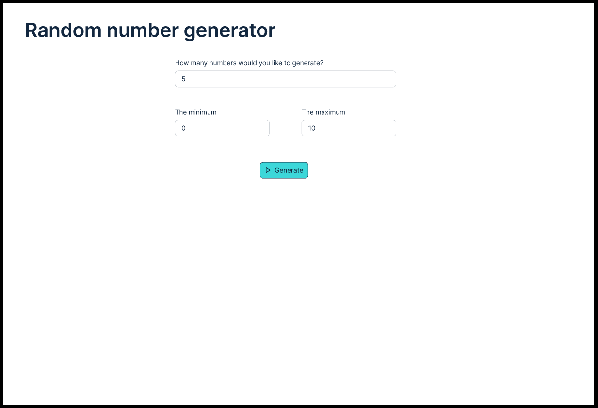
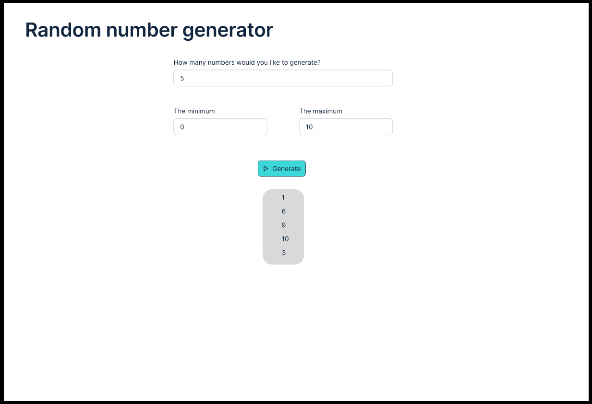
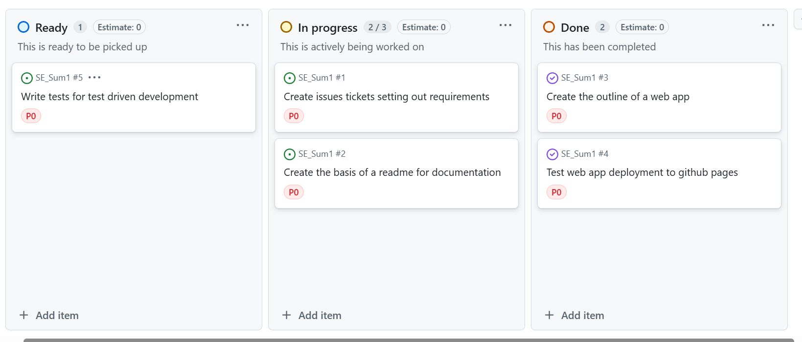
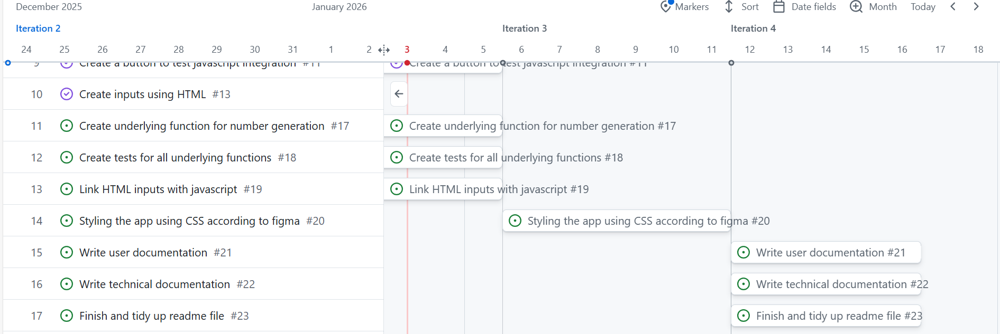
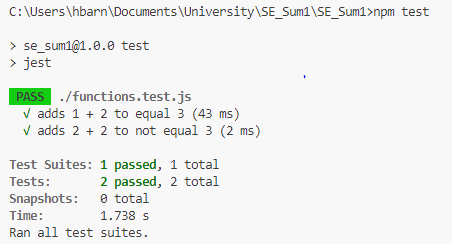

# Random number generator

## Project proposal

In this project I am going to create a simple web app for the purpose of randomly generating a list of a specified number of numbers. There will also be options for specifying a minimum and maximum value.

## Project design

I used figma to design and prototype my project. This involved creating a basic layout of the app including 3 different inputs and a button to generate the numbers. I used figma protyping to show how once the button was clicked the numbers generated would appear below.

## Project plan

I used github projects along with issues to plan and manage my project.

To do this I used an agile framework based around sprints, this was because due to holidays I needed to be flexible with project delivery. Working iteratively also ensured that I was able to continuously test the code and deployment with github pages ensuring that errors were spotted early on. I ensured I had a basic plan for each sprint by following a timeline as can be seen below, however, I added additional issues and tasks during each sprint when problems arose.

## Requirements

I used github issues to set out the requirements of the project using github projects to label the different prioritises so it was easy to see the relative importance of meeting each requirement in the sprint. There are additional requirements which are left as open tickets which could be completed in a second stage of the project using additional sprints.

Once the requirements for the project had been satisfied I merged that branch into the main branch using a pull request. I ensured that the issue was linked to the pull request by tagging it, however, noticed that this often resulted in duplications of an issue as it existed as a pull request and issue in the github project. Hence, I altered the github projects workflow to only add issues rather than pull requests to the project to fix this issue.

## Minimal Viable Product

The first stage of creating the minimal viable project (MVP) was first to understand the tech stack. Having never worked with github pages before I first wanted to ensure that my project could be hosted on the platform. I did this by first creating an HTML file and configuring the github actions to upload this to github pages. I then incorporated css into the HTML file and pushed the updates. The github actions enabled each new update to the branch to automatically update the github pages reducing the manual processes. I then tested the incorporation of Javascript using a basic button and found this successful on the deployed website.

I then focused on writing my unit testing framework to catch any errors during the development phase. This reduces the costs of bug fixes later on in the development. To do this I created a basic functions file with a simple test using the jest testing framework.

After this I expanded the HTML to contain all the inputs and outputs which would be needed in the final application.

## Testing

I started with a very basic test framework to ensure that jest was working correctly on my system.  Once I had ensured that the tests were working correctly locally I pushed them to github. I then used github actions to setup continuous integration testing. This means that whenever I push changes or do a pull request to the master branch the tests are automatically conducted ensuring that error are picked up immediately. This saves time running tests manually and ensures that high code standards are met.

## Documentation

### User documentation

### Technical documentation

#### Running the application locally

On organisation non-developer devices it is not possible to install node.js without obtaining additional permissions which require a lengthy approval process. To run the application locally you will either need a developer laptop or to use a personal laptop. If you believe there is business justification for having access to node.js then I recommend reaching out to the analytics enablement hub or the data community who will be able to offer additional advice.

##### Installing node.js and npm

To run this project locally you need an installation of node.js and npm. The easiest way to do this is to install node.js from [this link](https://nodejs.org/en/download/). I downloaded the prebuild version for windows as I didn't have docker on my computer which also came with npm reducing the need for two installations and ensuring compatibility between the two programs.

## Evaluation

2.	Design and prototype your product using Figma or an alternative
3.	Plan your project using modern planning techniques (for example, agile with sprints). Use a project management tool (for example, GitHub Projects, a free alternative to Jira). Add a dedicated section to your README that shows how you have used your project management tools
4.	Capture the requirements for your project as issues (aka tickets) accessible via your chosen project management tool
5.	Build the minimal viable product (MVP) or prototype step by step, and have a dedicated section in the README that narrates the process
6.	Use Test Driven Development to produce some of the codebase for your product and set up CI/CD (for example, with GitHub Actions)
7.	Use GitHub or an alternative to add features to your prototype or MVP gradually
8.	Document your MVP with both user and technical documentation. The user documentation should guide end users on how to use your app, while the technical documentation should explain the code, how to run the application locally, and how to conduct tests
9.	Maintain the ticketing system to keep the documentation up to date. Conventionally, one ticket corresponds to one feature, which in turn corresponds to one branch and one pull request. Bug tickets are documented differently from feature tickets
10.	Evaluate your product in a dedicated “Evaluation” section of your README
